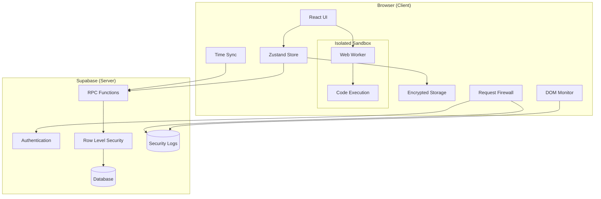

# Design Document: Security Hardening

## Overview

This design document outlines the technical architecture for implementing comprehensive security hardening in the CatCoder application. The implementation follows a defense-in-depth strategy, addressing vulnerabilities at multiple layers: code execution, data persistence, network communication, and client-side integrity.

The security model transforms the application from client-trusted to server-authoritative, where all sensitive operations (XP awards, progress tracking) are validated and executed server-side, while client-side defenses provide additional layers of protection against common attack vectors.

## Architecture



## Components and Interfaces

### 1. Sandboxed Code Runner

The code runner isolates user code execution in a Web Worker with restricted API access.

**File: `public/sandbox-worker.js`**

```javascript
// Web Worker for sandboxed code execution
self.onmessage = function(event) {
    const { code, language, executionId } = event.data;
    
    // Safe console implementation
    const safeConsole = {
        log: (...args) => self.postMessage({ 
            type: 'log', 
            data: args.map(a => typeof a === 'object' ? JSON.stringify(a) : String(a)).join(' ')
        }),
        error: (...args) => self.postMessage({ 
            type: 'error', 
            data: args.map(a => String(a)).join(' ')
        }),
        warn: (...args) => self.postMessage({ 
            type: 'warn', 
            data: args.map(a => String(a)).join(' ')
        })
    };

    try {
        // Create sandboxed function with blocked globals
        const sandboxedFn = new Function(
            'console', 'window', 'document', 'fetch', 
            'XMLHttpRequest', 'localStorage', 'sessionStorage',
            'indexedDB', 'navigator', 'location',
            `"use strict";\n${code}`
        );
        
        // Execute with null references for dangerous APIs
        sandboxedFn(
            safeConsole, 
            null, null, null, null, null, null, null, null, null
        );
        
        self.postMessage({ type: 'complete', executionId });
    } catch (error) {
        self.postMessage({ 
            type: 'error', 
            data: error.toString(),
            executionId 
        });
    }
};
```

**Interface: `src/hooks/useSecureCodeRunner.ts`**

```typescript
interface CodeRunnerResult {
    success: boolean;
    output: string[];
    errors: string[];
    timedOut: boolean;
}

interface UseSecureCodeRunnerReturn {
    runCode: (code: string, language: string) => Promise<CodeRunnerResult>;
    isRunning: boolean;
    terminate: () => void;
}

// Timeout constant
const EXECUTION_TIMEOUT_MS = 3000;
```

### 2. Server-Side XP System

XP awards are controlled exclusively through Supabase RPC functions with Row Level Security.

**SQL: RLS Policies**

```sql
-- Revoke direct write access
REVOKE INSERT, UPDATE, DELETE ON user_progress FROM anon, authenticated;
REVOKE UPDATE (xp, level, rank) ON profiles FROM anon, authenticated;

-- Enable RLS
ALTER TABLE user_progress ENABLE ROW LEVEL SECURITY;
ALTER TABLE profiles ENABLE ROW LEVEL SECURITY;

-- Read-only policies for users
CREATE POLICY "Users can view own progress" ON user_progress
    FOR SELECT USING (auth.uid() = user_id);

CREATE POLICY "Users can view own profile" ON profiles
    FOR SELECT USING (auth.uid() = id);

CREATE POLICY "Users can update non-XP profile fields" ON profiles
    FOR UPDATE USING (auth.uid() = id)
    WITH CHECK (auth.uid() = id);
```

**SQL: RPC Function**

```sql
CREATE OR REPLACE FUNCTION submit_completion(
    p_content_type TEXT,
    p_content_id TEXT,
    p_language TEXT,
    p_duration_seconds INTEGER DEFAULT NULL
) RETURNS JSONB
LANGUAGE plpgsql SECURITY DEFINER AS $$
DECLARE
    v_xp_reward INTEGER;
    v_user_id UUID;
    v_already_completed BOOLEAN;
BEGIN
    v_user_id := auth.uid();
    
    IF v_user_id IS NULL THEN
        RETURN jsonb_build_object('success', false, 'error', 'Not authenticated');
    END IF;
    
    -- Check if already completed
    SELECT EXISTS(
        SELECT 1 FROM user_progress 
        WHERE user_id = v_user_id 
        AND content_type = p_content_type 
        AND content_id = p_content_id
        AND status = 'completed'
    ) INTO v_already_completed;
    
    IF v_already_completed THEN
        RETURN jsonb_build_object('success', true, 'xp_awarded', 0, 'message', 'Already completed');
    END IF;
    
    -- Determine XP reward server-side
    v_xp_reward := CASE p_content_type
        WHEN 'lesson' THEN 50
        WHEN 'problem' THEN 100
        WHEN 'challenge' THEN 200
        ELSE 25
    END;
    
    -- Insert progress record
    INSERT INTO user_progress (user_id, content_type, content_id, status, duration_seconds, completed_at)
    VALUES (v_user_id, p_content_type, p_content_id, 'completed', p_duration_seconds, NOW())
    ON CONFLICT (user_id, content_type, content_id) DO NOTHING;
    
    -- Update profile XP atomically
    UPDATE profiles 
    SET xp = xp + v_xp_reward,
        level = calculate_level(xp + v_xp_reward),
        rank = calculate_rank(xp + v_xp_reward)
    WHERE id = v_user_id;
    
    RETURN jsonb_build_object('success', true, 'xp_awarded', v_xp_reward);
END;
$$;
```

### 3. Encrypted Storage System

**Interface: `src/lib/secureStorage.ts`**

```typescript
import CryptoJS from 'crypto-js';

interface SecureStorage {
    getItem: (name: string) => string | null;
    setItem: (name: string, value: string) => void;
    removeItem: (name: string) => void;
}

const SECRET_KEY = import.meta.env.VITE_STORAGE_ENCRYPTION_KEY || 'dev-fallback-key';

export const secureStorage: SecureStorage = {
    getItem: (name: string): string | null => {
        const encrypted = localStorage.getItem(name);
        if (!encrypted) return null;
        
        try {
            const bytes = CryptoJS.AES.decrypt(encrypted, SECRET_KEY);
            const decrypted = bytes.toString(CryptoJS.enc.Utf8);
            if (!decrypted) {
                // Corrupted data - clear it
                localStorage.removeItem(name);
                return null;
            }
            return decrypted;
        } catch {
            localStorage.removeItem(name);
            return null;
        }
    },
    
    setItem: (name: string, value: string): void => {
        const encrypted = CryptoJS.AES.encrypt(value, SECRET_KEY).toString();
        localStorage.setItem(name, encrypted);
    },
    
    removeItem: (name: string): void => {
        localStorage.removeItem(name);
    }
};
```

### 4. Request Firewall

**Interface: `src/lib/requestFirewall.ts`**

```typescript
interface FirewallConfig {
    allowedDomains: string[];
    onBlocked?: (url: string) => void;
}

const DEFAULT_ALLOWED_DOMAINS = [
    'supabase.co',
    'supabase.in',
    'jsdelivr.net',  // Pyodide CDN
    'pyodide.org',
    window.location.hostname
];

export function initializeFirewall(config?: Partial<FirewallConfig>): void;
export function isUrlAllowed(url: string): boolean;
```

### 5. DOM Integrity Monitor

**Interface: `src/lib/domMonitor.ts`**

```typescript
interface DOMMonitorConfig {
    onViolation?: (element: Element, type: string) => void;
    blockedTags: string[];
}

export function initializeDOMMonitor(config?: Partial<DOMMonitorConfig>): MutationObserver;
export function stopDOMMonitor(observer: MutationObserver): void;
```

### 6. Server Time Synchronization

**Interface: `src/lib/serverTime.ts`**

```typescript
interface TimeSync {
    offset: number;
    lastSync: number;
    isOutOfSync: boolean;
}

export async function syncServerTime(): Promise<TimeSync>;
export function getTrueTime(): number;
export function getTrueDate(): Date;
```

### 7. Security Logger

**Interface: `src/lib/securityLogger.ts`**

```typescript
type SecurityEventType = 
    | 'blocked_request'
    | 'dom_violation'
    | 'fingerprint_mismatch'
    | 'honeypot_access'
    | 'time_manipulation';

interface SecurityEvent {
    type: SecurityEventType;
    timestamp: string;
    userId?: string;
    metadata: Record<string, unknown>;
}

export async function logSecurityEvent(event: Omit<SecurityEvent, 'timestamp'>): Promise<void>;
```

## Data Models

### Security Log Table

```sql
CREATE TABLE security_logs (
    id UUID PRIMARY KEY DEFAULT gen_random_uuid(),
    event_type TEXT NOT NULL,
    user_id UUID REFERENCES auth.users(id),
    ip_address INET,
    user_agent TEXT,
    metadata JSONB DEFAULT '{}',
    created_at TIMESTAMPTZ DEFAULT NOW()
);

-- Index for querying by user and type
CREATE INDEX idx_security_logs_user ON security_logs(user_id, created_at DESC);
CREATE INDEX idx_security_logs_type ON security_logs(event_type, created_at DESC);
```

### Active Sessions Table (for Fingerprinting)

```sql
CREATE TABLE active_sessions (
    id UUID PRIMARY KEY DEFAULT gen_random_uuid(),
    user_id UUID REFERENCES auth.users(id) NOT NULL,
    device_hash TEXT NOT NULL,
    ip_address INET,
    user_agent TEXT,
    created_at TIMESTAMPTZ DEFAULT NOW(),
    last_active TIMESTAMPTZ DEFAULT NOW(),
    
    UNIQUE(user_id, device_hash)
);
```

## Correctness Properties

*A property is a characteristic or behavior that should hold true across all valid executions of a system—essentially, a formal statement about what the system should do. Properties serve as the bridge between human-readable specifications and machine-verifiable correctness guarantees.*

### Property 1: Console Output Capture

*For any* JavaScript code that calls console.log with any value, the Code_Runner SHALL capture that value and include it in the output array returned to the main thread.

**Validates: Requirements 1.4**

### Property 2: Blocked API Access with Graceful Handling

*For any* JavaScript code that attempts to access window, document, fetch, XMLHttpRequest, or localStorage, the Code_Runner SHALL prevent the access (returning null or undefined) and continue execution without throwing an unhandled exception.

**Validates: Requirements 1.2, 1.5**

### Property 3: Worker State Isolation

*For any* two sequential code executions, variables or state set in the first execution SHALL NOT be accessible in the second execution, ensuring complete isolation between runs.

**Validates: Requirements 1.6**

### Property 4: Duplicate XP Prevention

*For any* user and content combination, calling the submit_completion RPC function multiple times SHALL award XP only on the first successful call, with subsequent calls returning xp_awarded: 0.

**Validates: Requirements 2.5**

### Property 5: Storage Encryption Round-Trip

*For any* valid JSON-serializable data, encrypting it with secureStorage.setItem and then decrypting it with secureStorage.getItem SHALL return data equivalent to the original input.

**Validates: Requirements 3.1, 3.2**

### Property 6: Corrupted Storage Handling

*For any* corrupted or tampered localStorage value (not valid encrypted data), calling secureStorage.getItem SHALL return null and remove the corrupted entry from localStorage.

**Validates: Requirements 3.4**

### Property 7: Firewall Allowlist Enforcement

*For any* URL, the request firewall SHALL allow the request if and only if the URL's domain matches one of the configured allowed domains. Non-matching domains SHALL be blocked, and matching domains SHALL proceed normally.

**Validates: Requirements 6.2, 6.4, 6.5**

### Property 8: DOM Injection Removal

*For any* script or iframe element injected into the DOM after the monitor is initialized, the DOM Monitor SHALL detect and remove the element within one mutation observer callback cycle.

**Validates: Requirements 7.2**

### Property 9: Server Time Offset Calculation

*For any* server time response and local time, the getTrueTime function SHALL return a value equal to the current local time plus the calculated offset (accounting for network latency), such that the result approximates the actual server time.

**Validates: Requirements 8.2**

### Property 10: Security Log Structure

*For any* security event logged via logSecurityEvent, the resulting log entry SHALL contain: event_type (matching the input type), timestamp (ISO 8601 format), and all metadata fields provided in the input.

**Validates: Requirements 9.2**

## Error Handling

### Code Execution Errors

| Error Condition | Handling Strategy |
|----------------|-------------------|
| Syntax error in user code | Catch in worker, return error message via postMessage |
| Runtime exception | Catch in worker, return stack trace via postMessage |
| Infinite loop / timeout | Terminate worker after 3s, return timeout error |
| Worker creation failure | Fall back to error state, log to console |

### Storage Errors

| Error Condition | Handling Strategy |
|----------------|-------------------|
| Decryption failure | Return null, clear corrupted entry |
| localStorage quota exceeded | Catch error, notify user, clear old data |
| Invalid JSON in decrypted data | Return null, clear entry |

### Network/RPC Errors

| Error Condition | Handling Strategy |
|----------------|-------------------|
| RPC call failure | Return error object, do not update local state |
| Network timeout | Retry once, then return error |
| Authentication expired | Redirect to login |

### Security Event Logging Errors

| Error Condition | Handling Strategy |
|----------------|-------------------|
| Logging RPC failure | Silently fail, do not block application |
| Rate limiting | Queue events, batch send when possible |

## Testing Strategy

### Unit Tests

Unit tests will verify specific examples and edge cases:

- Code runner timeout behavior with infinite loops
- Storage encryption with various data types (strings, objects, arrays)
- Firewall domain matching edge cases (subdomains, ports, protocols)
- CSP meta tag presence and correct directive values
- Honeypot route definitions and redirect behavior

### Property-Based Tests

Property-based tests will use **fast-check** library to verify universal properties across generated inputs:

- **Minimum 100 iterations** per property test
- Each test tagged with: `Feature: security-hardening, Property N: {property_text}`

**Test Configuration:**

```typescript
import fc from 'fast-check';

// Configure fast-check for security testing
const securityTestConfig = {
    numRuns: 100,
    verbose: true,
    seed: Date.now() // Reproducible on failure
};
```

**Property Test Examples:**

1. **Console Output Capture**: Generate random strings, log them, verify capture
2. **Blocked API Access**: Generate code snippets accessing blocked APIs, verify graceful handling
3. **Storage Round-Trip**: Generate random JSON objects, verify encrypt/decrypt identity
4. **Firewall Allowlist**: Generate random URLs, verify correct allow/block decisions
5. **DOM Injection Removal**: Generate script/iframe elements, verify removal

### Integration Tests

- End-to-end XP award flow through RPC
- Device fingerprint verification on login
- Time synchronization accuracy
- Security event logging pipeline

